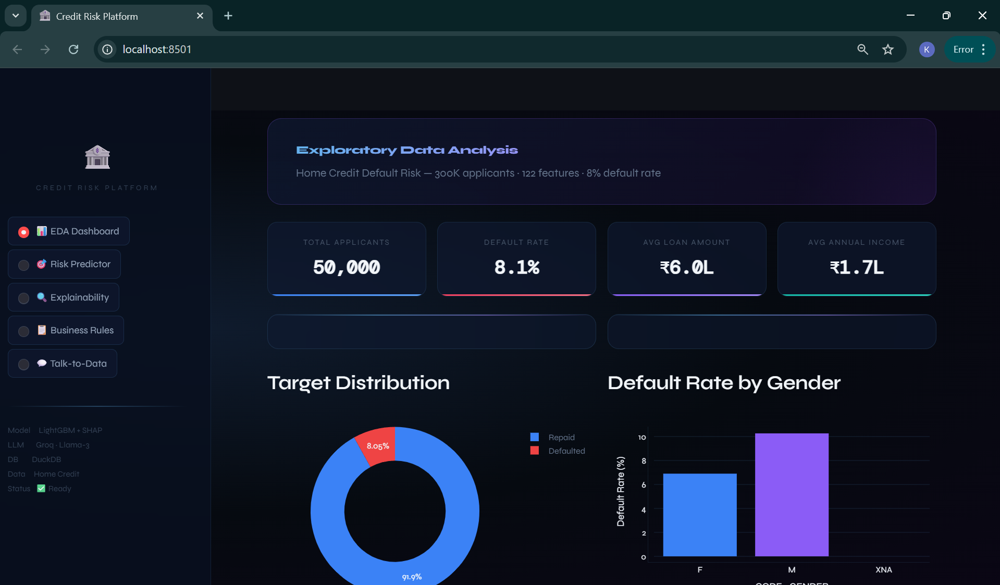
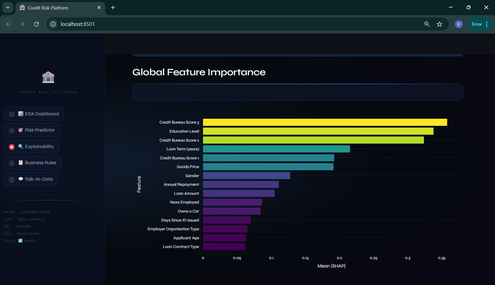
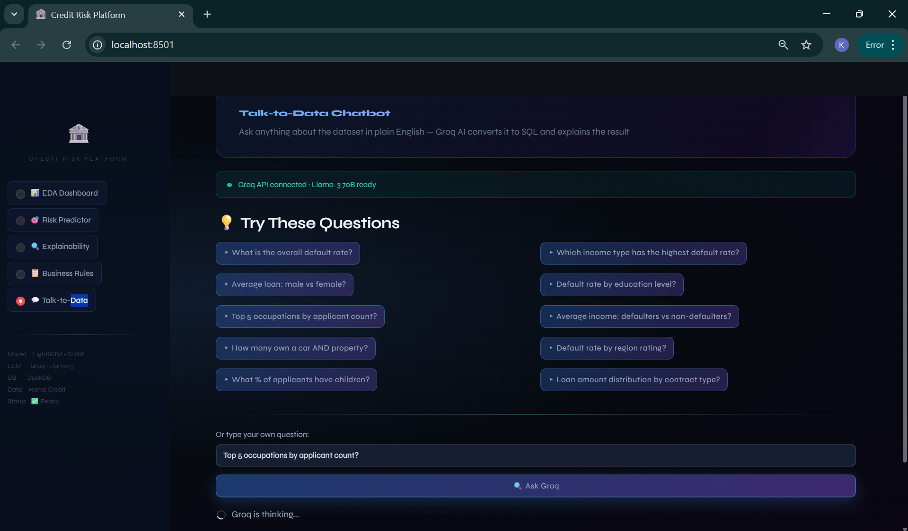

# Credit Risk Intelligence Platform

> Predict. Explain. Decide.

An end-to-end AI platform for credit risk scoring built on the Home Credit Default Risk dataset. Enter applicant details, get a default probability, understand the reasoning behind it, and query 300K+ records in plain English — all in one interface.

---

## What It Does

| Tab | What You Get |
|-----|-------------|
| **EDA Dashboard** | Visual breakdown of 307K applicants — demographics, income distribution, default patterns |
| **Risk Predictor** | Enter applicant details → get a default probability + Approve / Review / Decline decision |
| **Explainability** | SHAP waterfall and beeswarm charts showing which features drove the risk score |
| **Business Rules** | Plain IF-THEN rules derived from the ML model, suitable for policy and compliance teams |
| **Talk-to-Data** | Ask questions in plain English → Llama-3 converts them to SQL → DuckDB returns answers |

---

## Tech Stack

| Layer | Technology |
|-------|-----------|
| Frontend | React 18 · Recharts · Axios · HTML5 · CSS3 |
| Backend | Flask (Python 3.11) · Flask-CORS |
| ML Model | LightGBM 4.3 |
| Explainability | SHAP 0.45 (TreeExplainer) |
| Database | DuckDB 0.10 |
| LLM | Groq / Llama-3 70B |
| Deployment | Docker (multi-stage build) · Docker Compose |

The frontend is built as a static React bundle and served directly by Flask — no separate Node.js server in production.
---
## 🖼️ Screenshots

<table>
  <tr>
    <td width="33.3%"><br><sub><b>EDA Dashboard - Main Overview</b></sub></td>
    <td width="33.3%"><br><sub><b>Demographics & Age vs Default</b></sub></td>
    <td width="33.3%"><br><sub><b>Income & Default Patterns</b></sub></td>
  </tr>
  <tr>
    <td width="33.3%"><br><sub><b>Key Business Insights</b></sub></td>
    <td width="33.3%"><br><sub><b>Risk Predictor Form</b></sub></td>
    <td width="33.3%"><br><sub><b>Credit Bureau Score Inputs</b></sub></td>
  </tr>
  <tr>
    <td width="33.3%"><br><sub><b>Prediction Result & Model Metrics</b></sub></td>
    <td width="33.3%"><br><sub><b>SHAP Waterfall Explanation</b></sub></td>
    <td width="33.3%"><br><sub><b>Per-Feature SHAP Detail</b></sub></td>
  </tr>
  <tr>
    <td width="33.3%"><br><sub><b>Global Feature Importance</b></sub></td>
    <td width="33.3%"><br><sub><b>SHAP Beeswarm Summary</b></sub></td>
    <td width="33.3%"><br><sub><b>SHAP Chart & Key Predictors</b></sub></td>
  </tr>
  <tr>
    <td width="33.3%"><br><sub><b>Derived IF-THEN Rules</b></sub></td>
    <td width="33.3%"><br><sub><b>Top Features Used in Rules</b></sub></td>
    <td width="33.3%"><br><sub><b>Talk-to-Data Chatbot</b></sub></td>
  </tr>
  <tr>
    <td width="33.3%"><br><sub><b>NL Query Results & Chart of Talk-to-Data Chatbot</b></sub></td>
    <td width="33.3%"><br><sub><b>Docker Deployment in Terminal</b></sub></td>
    <td width="33.3%"><br><sub><b>Docker Deployment Container</b></sub></td>
  </tr>
  <tr>
    <td width="33.3%"><br><sub><b>Docker Logs & Resource Usage</b></sub></td>
    <td width="33.3%"></td>
    <td width="33.3%"></td>
  </tr>
</table>
---

---

## Architecture

```
Browser → React SPA (port 5000)
               ↓
         Flask REST API
         ├── /api/eda/summary      ← EDA Dashboard
         ├── /api/predict          ← Risk Predictor + SHAP
         ├── /api/explainability   ← Global SHAP importance
         ├── /api/rules            ← IF-THEN business rules
         └── /api/ask              ← NL → SQL → DuckDB
               ↓
         LightGBM model · DuckDB · Groq API
```

---

## Quick Start

### Prerequisites

- [Docker Desktop](https://www.docker.com/products/docker-desktop) installed and running
- A free [Groq API key](https://console.groq.com) (for the Talk-to-Data chatbot)
- A [Kaggle account](https://www.kaggle.com) to download the dataset

---

### Step 1 — Clone the repo

```bash
git clone https://github.com/kvya6/credit_risk_platform.git
cd credit_risk_platform
```

### Step 2 — Download the dataset

Go to the [Home Credit Default Risk competition page](https://www.kaggle.com/competitions/home-credit-default-risk/data), click **Download All**, unzip, and place the files in the `data/` folder:

```
data/
├── application_train.csv        ← Required (307K rows)
├── bureau.csv                   ← Optional — improves accuracy ~2%
├── previous_application.csv     ← Optional
└── installments_payments.csv    ← Optional
```

Only `application_train.csv` is required. The others improve model performance if included.

### Step 3 — Add your API key

```bash
cp .env.example .env
```

Open `.env` and paste your Groq key:

```
GROQ_API_KEY=gsk_xxxxxxxxxxxxxxxxxxxxxxxxxxxx
```

Leave all other values as-is.

### Step 4 — Train the model

```bash
docker-compose --profile setup run setup
```

This runs the full setup pipeline (5–10 minutes on first run):

- Loads and cleans data
- Engineers features
- Trains the LightGBM model
- Computes SHAP values
- Builds the DuckDB database
- Derives IF-THEN business rules

### Step 5 — Launch the app

```bash
cd ui_web
docker-compose up
```

Open **http://localhost:5000** in your browser.

```bash
# Stop the app
docker-compose down

# Rebuild after code changes
docker-compose down && docker-compose up --build
```

---

## Running Without Docker

**Backend:**

```bash
pip install -r ui_web/backend/requirements.txt
python setup_platform.py        # train model + build DB (if not done yet)
python ui_web/backend/app.py    # starts Flask on port 5000
```

**Frontend (development mode):**

```bash
cd ui_web/frontend
npm install
npm start                       # starts React dev server on port 3000
```

In development, React proxies API calls to Flask at `localhost:5000` (configured in `package.json`). In production, the Docker build compiles React to static files and Flask serves them directly.

---

## Project Structure

```
credit_risk_platform/
├── data/                        ← Kaggle CSVs go here (git-ignored)
├── models/                      ← Saved model artifacts (auto-generated)
├── documents/                   ← Project presentation
├── notebooks/                   ← EDA notebook
│
├── src/                         ← Core ML + data pipeline (shared)
│   ├── data/                    ← loader.py, preprocessor.py
│   ├── ml/                      ← train.py, predict.py, evaluate.py
│   ├── rules/                   ← rule_engine.py
│   ├── talk_to_data/            ← NL→SQL agent, DuckDB runner, prompt templates
│   └── utils/                   ← config.py, logger.py
│
├── ui_web/                      ← React + Flask web interface
│   ├── backend/
│   │   ├── app.py               ← Flask REST API (5 endpoint groups)
│   │   └── requirements.txt
│   ├── frontend/
│   │   ├── src/
│   │   │   ├── App.jsx          ← Root component + tab routing
│   │   │   ├── index.css        ← Global styles
│   │   │   └── tabs/            ← EDA · RiskPredictor · Explainability · BusinessRules · TalkToData
│   │   ├── public/index.html
│   │   └── package.json
│   ├── Dockerfile               ← Multi-stage: Node build → Python/Flask serve
│   └── docker-compose.yml
│
├── setup_platform.py            ← One-shot model training + DB setup
└── .env.example
```

---

## The ML Model

**Model:** LightGBM Classifier
**Dataset:** 307,511 applicants · 122 features
**Target:** Binary — 1 = defaulted, 0 = repaid
**Class imbalance:** 8.1% default rate, handled with `scale_pos_weight`

### Performance

| Metric | Score | Notes |
|--------|-------|-------|
| ROC-AUC | 0.7675 | 0.5 = random, 1.0 = perfect |
| PR-AUC | 0.2555 | 3.2× better than random (baseline ≈ 0.08) |
| Recall | 62.2% | Catches ~2 in 3 real defaulters |
| Precision | 19.1% | 1 in 5 flagged applicants actually defaults |
| F1 Score | 0.2916 | |
| Accuracy | 75.6% | |

High false positives are intentional — in lending, missing a true defaulter is costlier than extra caution.

### Top Risk Predictors (by SHAP importance)

| Rank | Feature | Direction |
|------|---------|-----------|
| 1 | External Credit Bureau Score 3 | Higher → lower risk |
| 2 | Education Level | Higher → lower risk |
| 3 | External Credit Bureau Score 2 | Higher → lower risk |
| 4 | Loan Term | Longer → higher risk |
| 5 | External Credit Bureau Score 1 | Higher → lower risk |

---

## API Reference

| Method | Endpoint | Description |
|--------|----------|-------------|
| GET | `/api/status` | Model, DB, and data readiness check |
| GET | `/api/eda/summary` | KPIs, distributions, and insights for the EDA dashboard |
| POST | `/api/predict` | Predict default probability + SHAP explanation for one applicant |
| GET | `/api/explainability` | Global SHAP importance + beeswarm data (500-sample) |
| GET | `/api/rules` | IF-THEN business rules derived from the decision tree |
| POST | `/api/ask` | Natural language → SQL → DuckDB results |

All endpoints return JSON. POST bodies are JSON with `Content-Type: application/json`.

---

## Talk-to-Data Chatbot

Ask anything about the dataset in plain English. Groq's Llama-3 70B generates SQL, runs it against DuckDB, and returns a readable answer.

Example questions:

- *"What is the overall default rate?"*
- *"Which income type has the highest default rate?"*
- *"Average loan amount: male vs female?"*
- *"Default rate by education level?"*
- *"How many applicants own a car and a property?"*

**Reliability features:**

- Schema-grounded prompts — the model can only reference columns that exist
- SELECT-only queries — no risk of data modification
- Auto-retry on SQL errors — the error is fed back to the model for self-correction
- `UNSUPPORTED_QUERY` fallback — the model signals when it can't answer rather than hallucinating
- Row limit of 20 — prevents runaway queries

---

## Business Rules

The platform distills the LightGBM model into readable IF-THEN rules for credit policy documentation and regulatory review.

Sample output:

```
HIGH RISK — Decline / Review
   IF Credit Bureau Score 3 ≤ 0.316
   → 734 applicants · 17.6% actual default rate

LOW RISK — Approve
   IF Credit Bureau Score 3 > 0.316
   IF Credit Bureau Score 2 > 0.389
   IF Education Level ≤ 1.500
   → 925 applicants · 4.0% actual default rate
```

---

## Environment Variables

| Variable | Required | Description |
|----------|----------|-------------|
| `GROQ_API_KEY` | Yes | Get a free key at [console.groq.com](https://console.groq.com) |
| `DATA_DIR` | No | Path to Kaggle CSVs (default: `./data`) |
| `MODEL_DIR` | No | Where model artifacts are saved (default: `./models`) |
| `DB_PATH` | No | DuckDB database location (default: `./data/credit_risk.duckdb`) |

---

## Known Limitations

| Limitation | Workaround |
|------------|-----------|
| Without `bureau.csv`, accuracy is ~2–3% lower | Add it to `data/` and re-run setup |
| EDA uses a 50K sample, not the full 307K | Statistically representative; adjust in `eda.py` if needed |
| Chatbot queries are limited to 2 tables | Extendable in `db_builder.py` |
| No authentication or login system | Not production-ready as-is |

---

## FAQ

**Do I need a paid Groq account?**
No — the free tier is sufficient. Llama-3 70B runs with ~1s latency.

**Why does the Docker build take a while the first time?**
The multi-stage build installs both Node.js (to compile React) and Python dependencies. Subsequent builds are much faster thanks to layer caching.

**Can I use the Flask API without the React frontend?**
Yes — all endpoints are standard REST and can be called from any HTTP client (curl, Postman, etc.).

**Why are the model metrics relatively modest?**
A PR-AUC of 0.2555 is 3.2× better than the random baseline of ~0.08, given the 8.1% default rate. Adding `bureau.csv` improves performance further.

**How long does setup take?**
The first run takes 5–10 minutes. Subsequent launches are instant — the model is cached.

---

*Built on the [Home Credit Default Risk](https://www.kaggle.com/competitions/home-credit-default-risk/data) dataset.*
